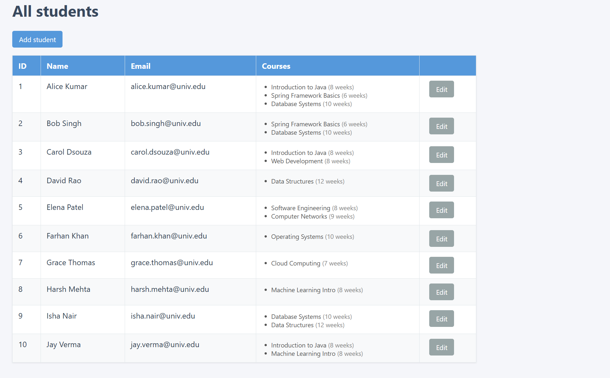
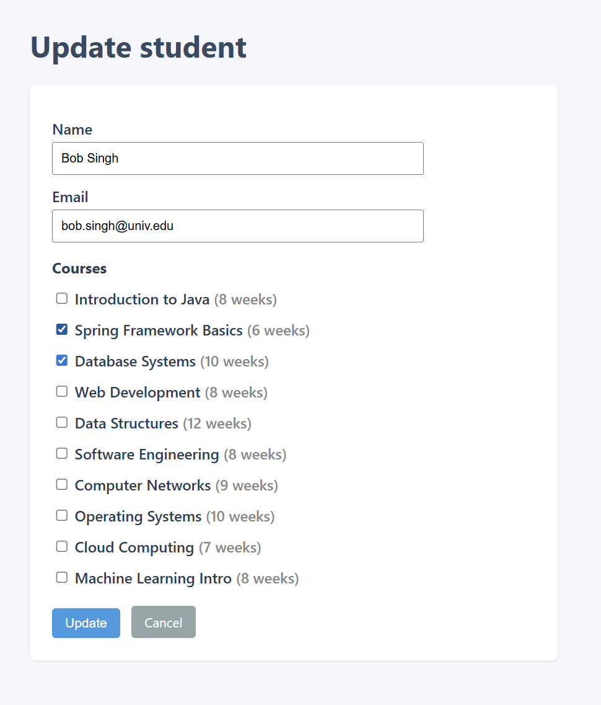

# Student–Course CRUD (Spring Boot + JSP)

A small **Create, Read, Update** web app for **Students** and **Courses** with a **many-to-many** enrollment relationship. Built for a BITS-style Spring Boot assignment: JPA entities, repositories, services, MVC controller, **JSP/JSTL** views, H2 + seed data, and basic tests.

---

## Screenshots

### Student list (read + navigation to add / edit)

Shows all students with emails and **enrolled courses** (many-to-many). Use **Add student** to create a record or **Edit** to update one.



### Update student (form + course checkboxes)

Edit name, email, and **multiple course enrollments** via checkboxes; **Update** saves, **Cancel** returns to the list.



---

## Features

- **Student CRUD (no delete):** list, add, save, edit, update  
- **Course** entity and enrollments: a student can take many courses; a course can have many students  
- **JSP + JSTL** (`c:forEach`, forms) under `src/main/webapp/WEB-INF/jsp/`  
- **Spring Data JPA** with a custom **JPQL** query using an **INNER JOIN** (see `StudentRepository`)  
- **H2** in-memory DB, schema from JPA, **`data.sql`** with sample students and courses  
- **JUnit 5** repository test (`@DataJpaTest`) and **Mockito** service tests  
- Simple error handling on save/update (message on the form or error page)

---

## Tech stack

| Area        | Choice                          |
|------------|----------------------------------|
| Runtime    | Java 17+                         |
| Framework  | Spring Boot 3.x                  |
| Web        | Spring MVC, JSP, JSTL            |
| Persistence| Spring Data JPA (Hibernate), H2  |
| Build      | Maven (includes `mvnw.cmd` wrapper) |
| Tests      | JUnit 5, Mockito, Spring Test    |

Optional **MySQL** is noted in comments inside `src/main/resources/application.properties`.

---

## Project layout (high level)

```
src/main/java/.../studentcourse/
  entity/          Student, Course
  repository/      StudentRepository, CourseRepository
  service/         StudentService, CourseService
  controller/      StudentController
src/main/resources/
  application.properties
  data.sql
src/main/webapp/WEB-INF/jsp/
  student-list.jsp, add-student.jsp, update-student.jsp, error.jsp
src/test/java/.../
  StudentRepositoryTest, StudentServiceTest
```

---

## How to run

1. **JDK 17+** and Git on your PATH (or set `JAVA_HOME`).
2. From the project root:

   ```bash
   ./mvnw.cmd spring-boot:run
   ```

   On macOS/Linux, use `./mvnw spring-boot:run` if you add the Unix wrapper, or run with a local Maven install:

   ```bash
   mvn spring-boot:run
   ```

3. Open **http://localhost:8080/students**

H2 console (when enabled): **http://localhost:8080/h2-console** — use the JDBC URL from `application.properties`.

---

## How to test

```bash
./mvnw.cmd test
```

---

## API / URLs (StudentController)

| Method | Path | Action |
|--------|------|--------|
| GET | `/students` | List all students |
| GET | `/students/add` | Add form |
| POST | `/students/save` | Save new student |
| GET | `/students/edit/{id}` | Edit form |
| POST | `/students/update` | Update student |

---

## Author / repo

Course assignment project; remote: **BITS-Spring-Boot-Assignment** on GitHub.
